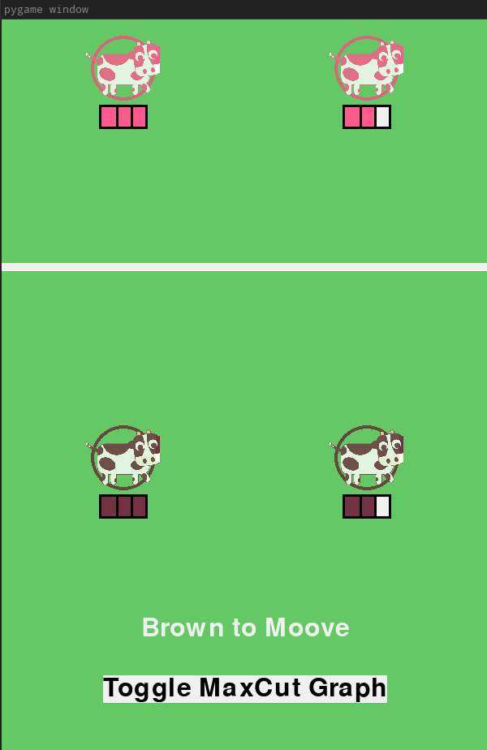
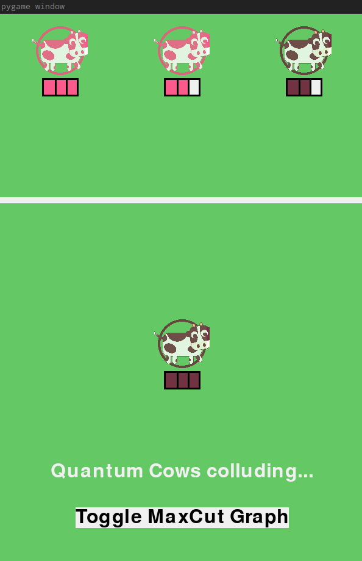
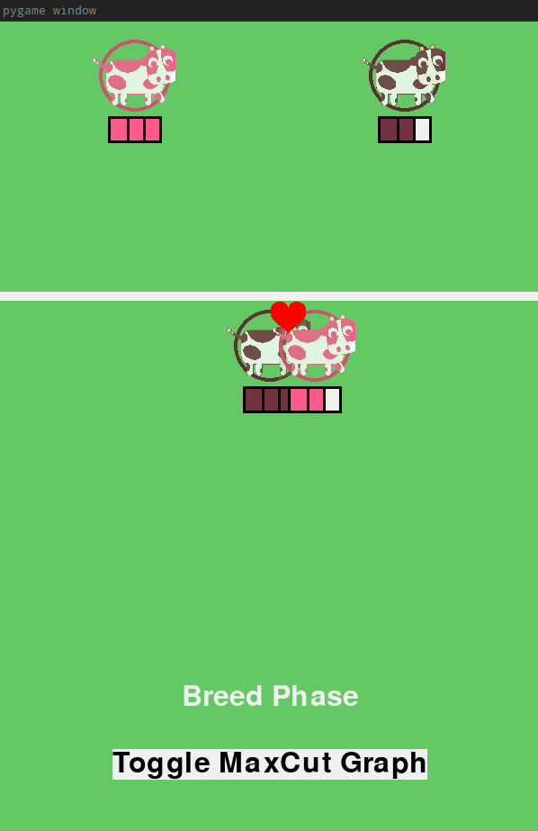
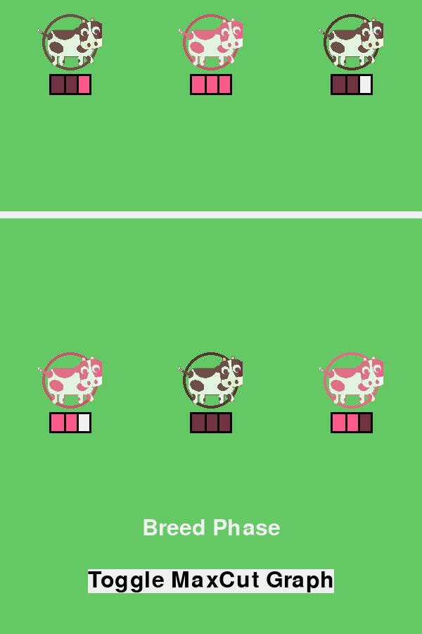
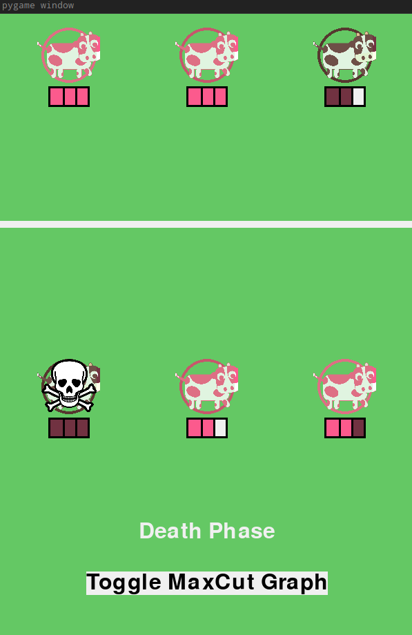

# Womanium-Quantum-Hackathon-2022

Welcome to our repo, we are the **Qordiggers**.

We are:

Joshua Moler - <https://github.com/Joshua-Moler>, joshuamoler00@gmail.com

Caleb Rotello - <https://github.com/CalebRotello>, caleb@rotello.dev (Pitch Presenter)

Bora Basyildiz - <https://github.com/b-basyildiz>, bbasyildiz@mines.edu

Hakan Ayaz - <https://github.com/hakanayaz>, ayazhakann@gmail.com

## Challange is Humans vs. Quantum Computers --> by IBM

Challenge definitions are given by IBM and which is here:

Create a working interactive ‘program’ (it can be a website, game, app, etc.) in which a human user is facing off against a quantum computer. This is broad on purpose - the program can be built in many different ways. Your program should implement strategies that seriously challenge the human player. The implementation must utilize more than just probabilities related to measuring quantum states. You must use Qiskit to program the computer’s gameplay strategy, and as much as possible, the strategy should be implemented with quantum circuits and quantum gates on real quantum hardware (although using the Simulator is understandable given the time limit)

## Solution: **MILQ Simulator**

You are humanity's last hope.

Chocolate milk cows are under threat of extinction by quantum strawberry milk cows. These quantum strawberry milk cows are a terrifying breed that communicates with a hive mind that moves each member of the herd by solving a quantum optimization problem. They will achieve this goal by out-breeding the chocolate gene; you must defend chocolate milk by attempting to do the same to the strawberry milk cows.

As a solution, we create the MILQ simulator, a party affiliation congestion game.

The quantum AI works: each game-state can be represented as a not-all-equal boolean satisfiability problem. The solution to this problem is the Nash Equilibrium of the game; no party can move away from equilibrium and only benefit themselves. Therefore, the quantum AI will only make moves towards the Nash equilibrium. If the player makes any move away from equilibrium, they will be punished and likely lose. The Quantum AI section of the README will go into more detail about how this works.

### Game Description

Our game idea comes from the paper that we read which is [On Strong Equilibria in the Max Cut Game
](https://www.researchgate.net/profile/Jerome-Monnot/publication/44241087_On_Strong_Equilibria_in_the_Max_Cut_Game/links/0c96052a841f89f843000000/On-Strong-Equilibria-in-the-Max-Cut-Game.pdf?origin=publication_detail).

As mentioned, our game is defined as a party affiliation congestion game. Specifically, it is a set of cows on a field. On the field, we have two separate farms with two cows each. One side starts with chocolate milk cows, while the other starts with strawberry milk cows. The player starts as the chocolate milk cow farmer, and the **Quantum AI** starts as a strawberry milk cow farmer. The player's goal is to make all the cows on the field all chocolate milk cows. Moves can be made by strategic breeding and moo-ving cows.

The game has three distinct stages: the moo-ving stage, the breeding stage, and the death stage. These stages repeat until all the cows are all either strawberry or chocolate milk cows. If all the cows are chocolate milk, then the player wins! If all the cows are strawberry milk, the Quantum AI wins!

Before starting the game, the player can choose a difficulty. There are three difficulties available: Easy, Medium, and Hard. The key distinction between the three difficulties is the number of cows that each farmer starts with. In an Easy game, both farmers begin with two cows. For Medium, both start with three cows. For Hard, both start with five cows. For the player, this means more cows to keep track of, more options to choose from, and overall a more complex strategy as the difficulty increases. That said, it's not smooth sailing for the AI either. The computational problem scales exponentially with the number of cows, so as the difficulty increases, the strategy becomes more and more difficult to simulate. However, by reducing the strategy to a quantum optimization problem, an approximate solution can be generated with a polynomial number of gates (note that there is still exponential overhead for classically simulating these circuits). In this way, our AI is able to compete at all three levels of difficulty.

## Step-by-Step Gameplay Actions

### Moo-ving Cows

First, the game will start like this;

Then, the player will have the option to move one of their cows to the other farmer's field. Which will be like this in the game. Because in this case we choose the right side of the brown cow.

As seen in the picture brown cow is mooved through the opposite side of the game. A player must move one cow they control. All chocolate milk cows are governed by the player, no matter what farm they are on. Thus the player must strategically move their cows so that the chocolate milk cows outbreed the strawberry milk cows (Breeding will explain this in the next section). Similarly, the Quantum AI will also be forced to move one of their strawberry milk cows.

### Breeding

After both players move a respective cow, the breeding process takes place. On each farm, two random cows will choose to breed, and their offspring will be a strawberry or chocolate milk cow, depending on each cow's gene makeup. While breeding is happening game will be like this:

And after breeding it will like this;

### Genes

Each cow has a set of three genes, and all three of those genes can be either brown, pink, or nothing. A cow with the pinkest or brown genes will be a chocolate or strawberry milk cow. If there is a tie, for example, a cow can have a pink, brown, and none gene makeup, and then the cow is randomly selected to be a chocolate or strawberry milk cow.

### Death

The last mechanic in the MILQ Simulator game is the death mechanic. At the end of each breeding stage, one cow from each respective farm dies, which is given below;

As seen in the picture, one cow will die. The probability of a cow dying is based on age, and it relates to how many turns the cow has been on the board.

### Quantum AI

The controller of the strawberry cows is a Quantum AI. We designed the game through a series of mathematical reductions and QAOA optimizations.

First, our game is defined as a congestion game, which can be reduced to the [Not-all Equal (NAE) SAT problem](https://www.csie.ntu.edu.tw/~lyuu/complexity/2010/20101102.pdf).

We can further reduce the NAE SAT problem to [NAE 3-SAT](https://npcomplete.owu.edu/2014/07/22/not-all-equal-3sat/) and reduce it a final time to the well-studied [Max-Flow problem](https://www.geeksforgeeks.org/max-flow-problem-introduction/) (All reductions are polynomial time).

We then use gate-based [Quantum Annealing](https://arxiv.org/abs/1411.4028) to find the best solution to the Max-Flow problem, and we use this solution to generate the next move in our congestion game. The circuit is an alternating sequence of a mixing and cost Hamiltonian, which will start with a $\pi/2$ amplitude on $H_{mix}$ and $0$ on $H_{cost}$, and smoothly ramp between the two until $H_{mix}$ has amplitude $0$ and $H_{cost}$ has amplitude $\pi/2$ on the final time-step. We then take the $\sigma^z$ basis state, which appears the most in measurement. We will not prove this part, as this is a hackathon, but heavy theoretical work has been done to prove the quantum adiabatic theorem and its annealing application. The bonus of this approach is that it removes the variational element of the typical QAOA algorithm, thus heavily improving the overhead. This may make the game more susceptible to noise on real hardware.

Please see the Hackathon_Math.pdf in the Documents folder for a more theoretical explanation.

### How to Play

To play the game on your local machine, you will have to navigate to the directory with the file 'MILQ_SIM.py.' Then, within your respective terminal, run the 'MILQ_SIM.py' file. Make sure that the other files within the directory are not moved, as they are dependencies. A pygame window should show up, and the player will be prompted within the terminal with three options.

  (a) Locally (for beefy computers)
  
  (b) IBM remote (qiskit) + new token'
  
  (c) IBM remote (qiskit) + saved token
  
  Input option a/b/c :
  
The player should choose what option best fits their situation. For most first-time players, the local option should be selected. Once an option is selected, the player will be prompted with a difficulty setting, and the game is ready to play!

### Educational Application

For those unfamiliar, our game is an excellent introduction to the applications of Quantum Computing. First, our game takes no knowledge of Quantum Computing, STEM, or any high-level problem solving to play. Thus sheer simplicity of our game attracts new people to see the direct use of Quantum Computing (the Quantum AI). Also, suppose the player is interested in the theory behind the game. In that case, they can toggle the graph function or check out the mathematical theory that is contained in the Hackathon_Math.pdf file in the Documents folder.

### Future Possible Work

While we were deliberate on solving all bugs we have found, we are sure that there are more that will be found if the game has thorough usage. Also, even though the GUI has a great 8-bit feel, to fully actualize our game the GUI must be updated and worked on further.

Mathematically, there is a serious of reductions that are necessary for computation, and all of these take away from the efficiency of the Quantum AI. An improvement can be made by creating a cost Hamiltonian that Quantum Annealing uses in one of the NAE SAT problems. This would enable our program to have a Quantum optimization with less mathematical overhead.

Lastly, we are using quantum simulations for our Quantum Simulated annealing. A direct extension of our game would be running it on an actual Quantum Comptuer.
